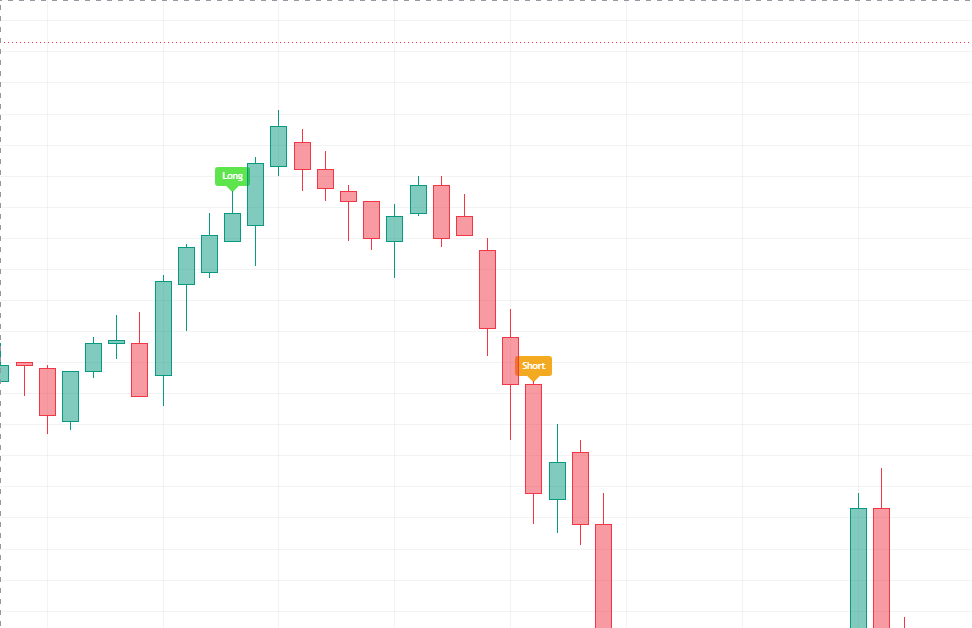

# Pine-Script-RSI-Based-Ver.2
Indicator based on RSI, 200 EMA, MACD, and conversion line from Ichimoku. Signals entry for long/short in futures for any cryptocurrency on Trading View.

--

Chart Preview

--

## Motivation & Problem

- **Market Noise & False signals**: The previous indicator yielded unstable and inaccurate results due to a lack of ability to check for the complete conversion of the trend across multiple time horizons.
- **The Core Goal**: To create an indicator that is trustworthy, improving the accuracy of reading the momentum and trend was necessary. The system still implied the multi-timeframe momentum confirmation and the merging of different indicators.
--

## Strategy Logic & Architecture

- This indicator avoids false signals and wrong interpretation of the trend by utilizing a **rule-based, multi-factor filtering system**:

### Core Components:
1. **Trend & Momentum Filter**:
   - Uses a 200 EMA on the 3-minute timeframe to determine macro trend bias (close > EMA10 or close < EMA10).
   - The conversion line in Ichimoku is used to detect the short-term trend by checking whether the slope is upward or downward.
   - The MACD line from the 1-minute timeframe confirms fast momentum crossing above or below the zero line.

2. **Multi-Timeframe RSI**:
   - Instead of relying solely on local RSI, the script pulls RSI data from multiple timeframes (3m, 5m, 10m) using 'request.security()'
   - Confirms that macro momentum supports the local price action by verifying that RSI values of different lengths (7, 9, 12) are sorted sequentially.
   
3. **Execution Rule**

   - **Bullish Signal**: Triggers when price is above the 200 EMA in a 3-minute timeframe, and the conversion line has a slope greater than 0, and the 1-minute MACD line is above 0, and the RSIs from multi-timeframes are all sorted from least to greatest length above 55, and at least one timeframe's RSI crosses above 55.
   - **Bearish Signal**: Triggers when price is below the 200 EMA in a 3-minute timeframe, and the conversion line has a slope less than 0, and the 1-minute MACD line is below 0, and the RSIs from multi-timeframes are all sorted from greatest to least length below 45, and at least one timeframe's RSI crosses below 45.
     
--

## Configurable Parameters
Users can adjust the following parameters inside TradingView's settings panel:

EMA Length: Default - 200. Lookback period for the 3-minute macro moving average.
RSI Time Frame: Default - 3, 5, 10. Multi-timeframe intervals for RSI confirmation.
RSI Length: Default - 7, 9, 12. Lookback period for RSI.
MACD Time Frame: Default - 1. Lookback timeframe for the MACD line.
Conversion Line Length: Default - 9. Lookback period for conversion line.
--

How to Install & Use in TradingView

1. Open any crypto chart (e.g., `BTC/USDT`) on **[TradingView](https://www.tradingview.com/)**.
2. Open the **`Pine Editor`** console at the bottom of the page.
3. Open `indicator.pine` from this repository, copy the source code, and paste it into the editor.
4. Click **`Save`** and then click **`Add to Chart`**.
5. Click the gear icon (`Settings`) on the indicator to adjust parameters as needed.

--

## Key Learnings & Engineering Reflections
1. **Multi-Timeframe Confluence with request.security()**
  - I learned that pulling indicator data from multiple timeframes (1m, 3m, 5m, 10m) ensures micro momentum aligns directly with the macro trend. It is a helpful tool for filtering out spurious signals caused by brief price spikes.
Sequential Multi-Period Alignment
  - I learned that checking whether multiple RSI lengths (7, 9, 12) are sorted in order above 55 or below 45 provides strong confirmation of directional momentum. This is useful for avoiding false breakouts in choppy markets before the trend is firmly established.
